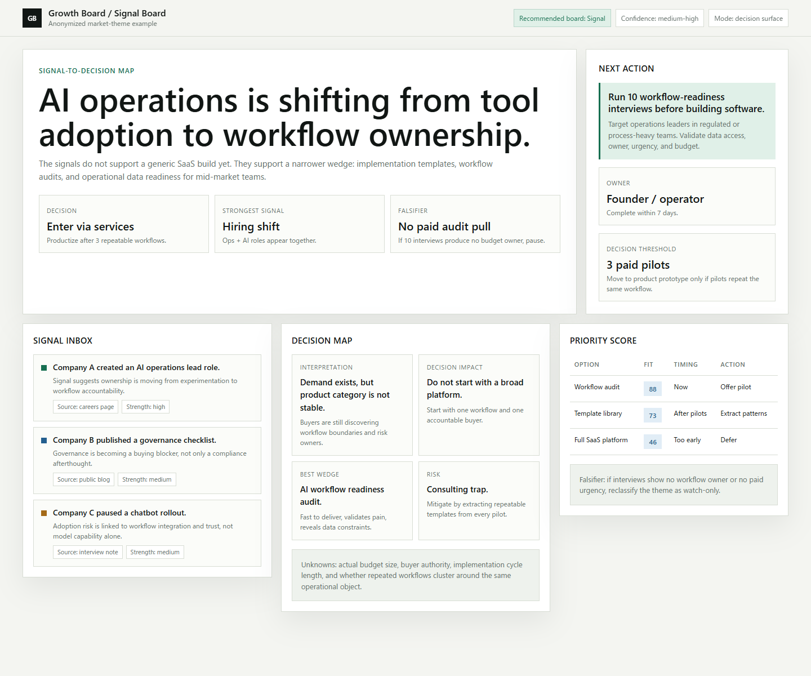
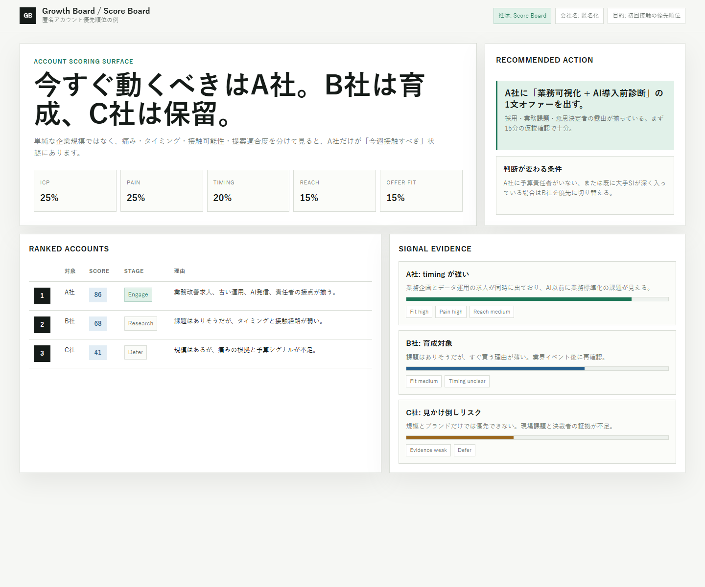
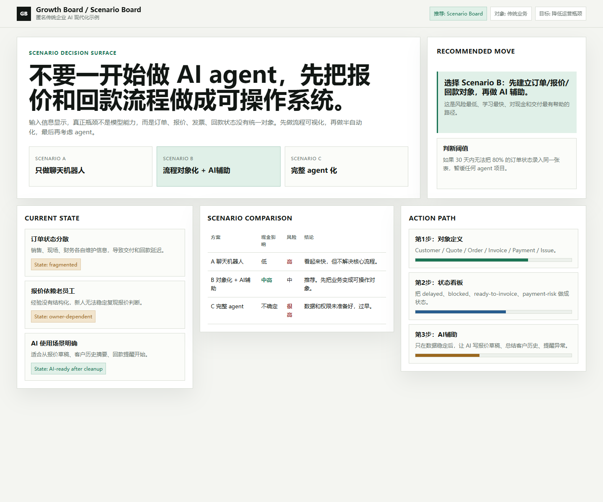

# Growth Ops

**Growth Ops turns messy business information into decision-ready operating assets.**

[English](./README.md) | [日本語](./docs/README.ja.md) | [中文](./docs/README.zh-CN.md)

Growth Ops is for solo operators, founders, small companies, consultants, investors, and new-business builders who need sharper answers than a generic AI summary.

Paste rough notes, URLs, company lists, market questions, customer signals, business problems, or AI workflow ideas. Growth Ops helps turn them into practical outputs:

- market radars
- opportunity cards
- account / lead scorecards
- operating memos
- turnaround and value-creation plans
- proposal briefs
- deck briefs
- Growth Board GUI specs
- content plans
- reusable skill blueprints

The core idea is simple:

```text
messy information -> structured judgment -> practical next action -> usable business asset
```

## Who It Helps

Growth Ops is useful when you are:

- exploring a market or business theme
- deciding which company, account, partner, or idea to prioritize
- taking over or improving a small or legacy business
- turning research into a proposal, article, deck, or dashboard
- designing an AI workflow for real operations
- trying to separate real signal from noise

It is built to answer:

- What matters here?
- What is the actual decision?
- What evidence supports it?
- What should we do next?
- What would prove us wrong?

## What It Can Produce

| Need | Output |
|---|---|
| Market or theme evaluation | Market radar, opportunity map, watchlist |
| Sales / partner / target selection | Scorecard, priority list, next-action plan |
| Small-business diagnosis | Operator memo, 30/60/90-day plan |
| Business improvement | Value-creation plan, initiative tracker |
| AI workflow design | Workflow map, guardrails, eval plan |
| Research packaging | Brief, article outline, deck brief |
| Visual operating surface | Growth Board GUI / HTML concept |

## Growth Board GUI

Growth Ops can also create **Growth Board** concepts: visual screens that show how information becomes judgment and action.

```text
signal -> interpretation -> decision -> action
```

The examples below are anonymized HTML samples rendered from this repository.

<a href="./examples/growth-board-en-signal.html">
  
</a>

<table>
  <tr>
    <td width="50%">
      <a href="./examples/growth-board-ja-score.html">
        
      </a>
    </td>
    <td width="50%">
      <a href="./examples/growth-board-zh-scenario.html">
        
      </a>
    </td>
  </tr>
</table>

Open the examples:

- [Examples index](./examples/index.html)
- [English Signal Board](./examples/growth-board-en-signal.html)
- [Japanese Score Board](./examples/growth-board-ja-score.html)
- [Chinese Scenario Board](./examples/growth-board-zh-scenario.html)

## Quick Start

In Codex:

```text
[$growth-ops]
Make this decision-ready.
<paste notes, URL, company list, idea, or situation>
```

For a GUI:

```text
[$growth-ops]
Turn this into a Growth Board.
<paste messy business information>
```

For a small business:

```text
[$growth-ops]
Diagnose this business and give me a practical 90-day plan.
<paste situation>
```

For market / account scoring:

```text
[$growth-ops]
Score these opportunities and tell me what to do first.
<paste list>
```

## Design Philosophy

Growth Ops avoids surface-level output. It should not only summarize; it should clarify the decision, expose assumptions, identify the mechanism, and produce a next action.

It does not claim access to private databases or proprietary playbooks. It works from public patterns, user-provided information, local files, and available research tools, while keeping facts, assumptions, and unknowns separate.

## Repository Structure

- `SKILL.md`: the skill entry point
- `references/`: internal operating playbooks and decision lenses
- `templates/`: reusable output formats
- `examples/`: HTML Growth Board examples
- `docs/`: multilingual documentation

## License

MIT
